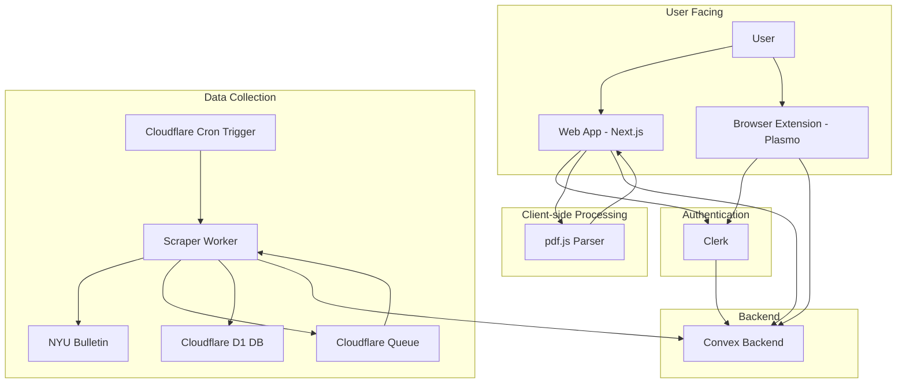

Understanding the flow of data is crucial to comprehending how AlbertPlus works. The platform is designed around a robust data pipeline that ensures course information is accurate, up-to-date, and delivered efficiently to the user.

## Course Data Pipeline

The primary data pipeline is responsible for collecting, storing, and serving course and program information.

1. **Scraping (Cloudflare Worker)**
   - **Trigger**: The process begins with a scheduled job (cron trigger) or http handlers in the Cloudflare Worker.
   - **Discovery**: The scraper first discovers the URLs for all available programs and courses from NYU's public course catalog.
   - **Job Queuing**: For each discovered program and course, a new job is added to a Cloudflare D1 queue. This allows for resilient and distributed processing.
   - **Data Extraction**: Each job in the queue is processed by the worker, which scrapes the detailed information for a specific course or program.
   - **Upsert to Backend**: The scraped data is then sent to the Convex backend via an HTTP endpoint.

2. **Backend Processing (Convex)**
   - **Data Reception**: The Convex backend receives the scraped data from the Cloudflare Worker.
   - **Database Storage**: The data is upserted into the Convex database, ensuring that existing records are updated and new ones are created. This includes courses, programs, requirements, and prerequisites.
   - **Real-time Updates**: Any clients connected to the Convex backend (such as the web app) will receive real-time updates as the new data is written to the database.

3. **Client-side Consumption (Web App & Browser Extension)**
   - **Data Fetching**: The Next.js web app and the browser extension query the Convex backend to fetch course and program data.
   - **User Interface**: The data is then rendered in the user interface, allowing students to browse the course catalog, view program requirements, and build their schedules.

## Degree Progress Report Parsing

Another important data flow involves the parsing of a student's degree progress report.

1. **File Upload**: The user uploads their degree progress report (in PDF format) through the web application.
2. **Client-side Parsing**: The PDF is parsed directly in the browser using the `pdfjs-dist` library. This approach enhances privacy as the user's academic records are not sent to the server.
3. **Data Extraction**: The parsed text is then processed to extract the student's completed courses and grades.
4. **Backend Storage**: The extracted course information is stored in the `userCourses` table in the Convex database, associated with the authenticated user's ID.
5. **Degree Audit**: This stored data can then be used to compare against program requirements, providing the student with an audit of their academic progress.

## Visual Representation

The following diagram provides a visual representation of the data flow within the AlbertPlus platform:

